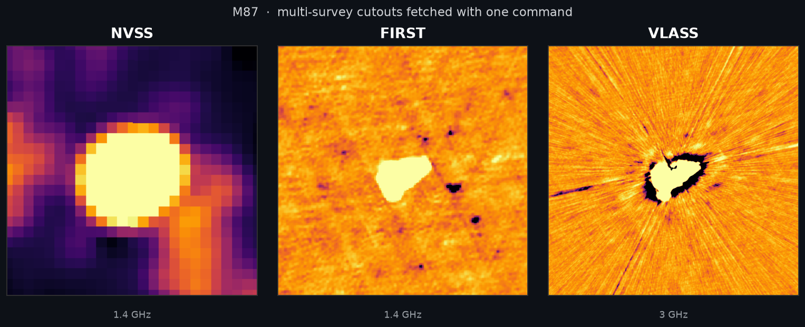
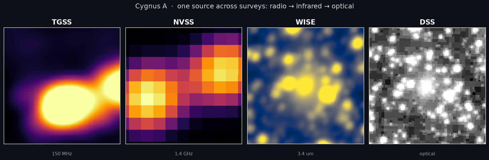
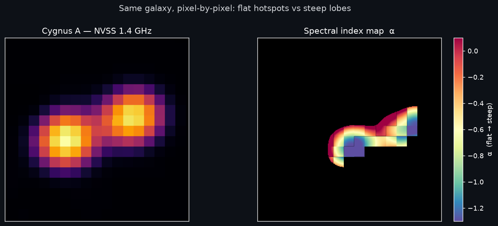
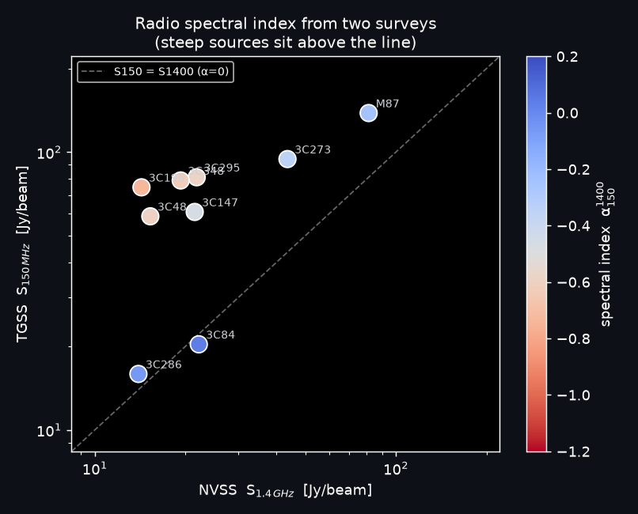
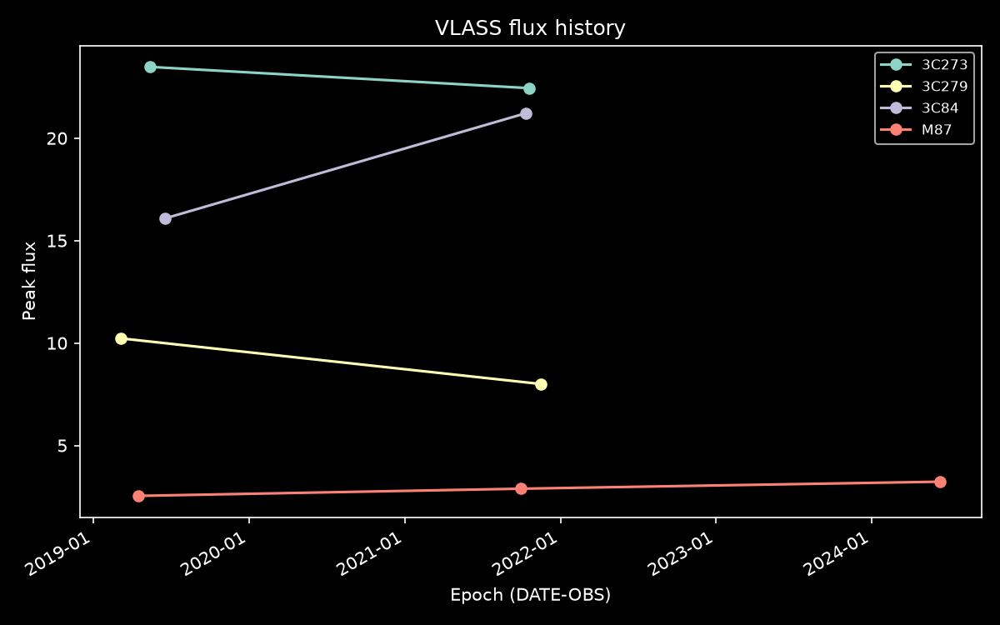

# CIRADA SENPY

[](https://github.com/JavierArredondo/cirada_senpy/actions/workflows/unit_tests.yml)
[](LICENSE)
[](https://www.python.org/downloads/)

The **CIRADA** cutout **SE**rvice i**N** **PY**thon is a small package and CLI to
**batch-download astronomical image cutouts** from multiple surveys, given a
table of coordinates or source names.



<p align="center"><em>M87 fetched across three radio surveys with a single
<code>senpy download</code> — data: NRAO/VLA (NVSS, FIRST) &amp; CADC (VLASS), rendered with astropy.</em></p>

It takes a target table (CSV / Parquet / Pickle), fetches a cutout per target per
survey, and writes the results as FITS files — with a progress bar and resumable,
skip-existing behaviour. Cutouts are pulled **directly from each survey's data
archive** via [astroquery](https://astroquery.readthedocs.io/):

| Survey | Band | Source |
|--------|------|--------|
| `VLASS` | radio 3 GHz | CADC |
| `NVSS` | radio 1.4 GHz | SkyView |
| `FIRST` | radio 1.4 GHz | SkyView |
| `TGSS` | radio 150 MHz | SkyView |
| `SUMSS` | radio 843 MHz | SkyView |
| `GLEAM` | radio 170–231 MHz | SkyView |
| `WISE` | IR 3.4 µm | SkyView |
| `SDSS` | optical r | SkyView |
| `DSS` | optical | SkyView |

The default survey set is `VLASS,NVSS,FIRST`.

## Gallery — real science from a few fetches

Because senpy pulls the **same patch of sky from many surveys**, a handful of
cutouts is enough to do actual radio astronomy. Every figure below is generated
directly from `fetch_survey(...)` output — nothing is hand-drawn.

**One source across the spectrum — Cygnus A (radio → infrared → optical):**



**Spectral index from two surveys.** Source brightness follows _S ∝ ν<sup>α</sup>_,
so two frequencies give the spectral index α — which separates source physics
(flat α≈0 → AGN cores/hotspots; steep α≈−0.7 → aged lobes). Computing α
**per pixel** between TGSS (150 MHz) and NVSS (1.4 GHz) recovers Cygnus A's
textbook structure: flat hotspots where the jets terminate, steepening into the
aged lobes.



The same idea as a **single feature per source**, over a sample of bright
calibrators — flat-spectrum cores (3C84, blue) cleanly separate from
steep-spectrum sources (the 3C calibrators, red):



> These are **indicative** spectral indices from peak flux on each survey's
> native beam (TGSS ≈ 25″, NVSS ≈ 45″); a publication-grade α convolves both to a
> common resolution and integrates flux. The point is that the multi-survey data
> — and the feature — drop straight out of the tool.

Reproduce every figure above from live data:

```bash
uv run --extra viz python examples/gallery.py
```

The spectral-index helpers live in [`cirada_senpy/science.py`](cirada_senpy/science.py)
as pure functions — `spectral_index`, `spectral_index_map`, `matched_cutouts`,
`peak_flux` — which a `senpy spectral-index` command will wrap next.

## Requirements

- Python ≥ 3.10
- [uv](https://docs.astral.sh/uv/) for development (recommended)

## Installation

With [uv](https://docs.astral.sh/uv/):

```bash
uv pip install git+https://github.com/JavierArredondo/cirada_senpy.git
```

Or from a clone:

```bash
git clone https://github.com/JavierArredondo/cirada_senpy.git
cd cirada_senpy
uv pip install .
```

## Usage

### Input format

A table with `ra`, `dec`, and `name` columns. For each row, explicit `ra`/`dec`
(decimal degrees or sexagesimal) are used if present; otherwise the `name` is
resolved via Sesame:

| ra          | dec         | name  |
|-------------|-------------|-------|
| 187.7059    | 12.3911     | M87   |
| 162.338077  | -0.66805    |       |
|             |             | M87   |
| 05h 35m 18s | -05d 23m 0s | Orion |

### CLI

```bash
senpy download <input_table> <output_dir> [options]
```

Options:

| Option | Default | Description |
|--------|---------|-------------|
| `-s, --surveys` | `VLASS,NVSS,FIRST` | Comma-separated survey keys (see table above). |
| `-r, --radius` | `3.0` | Cutout radius in arcminutes. |
| `--overwrite` | off | Re-fetch cutouts that already exist (default: skip). |

```bash
# VLASS + NVSS cutouts, 5 arcmin radius
senpy download targets.csv ./cutouts -s VLASS,NVSS -r 5
```

Outputs are written as `<label>_<SURVEY>.fits` (where `<label>` is the source
name, or its coordinates if unnamed). A survey returning multiple tiles/epochs —
e.g. VLASS — is saved as `<label>_VLASS_1.fits`, `<label>_VLASS_2.fits`, … Re-running
the same command skips targets already on disk, so interrupted batches resume
cleanly.

### Measure — cutouts to a feature catalog

Beyond downloading, `senpy measure` fetches each target in each survey and
**measures** it into one tidy catalog (CSV / Parquet / Pickle):

```bash
senpy measure targets.csv catalog.csv -s NVSS,FIRST,VLASS -r 3
```

| column | meaning |
|--------|---------|
| `source`, `ra`, `dec` | target label and position |
| `survey`, `tile` | survey key and tile index (radio surveys can return several) |
| `peak` | peak pixel value (units in `bunit`, e.g. Jy/beam) |
| `integrated` | beam-corrected integrated flux (radio only; NaN for optical/IR) |
| `rms`, `snr` | robust background noise and peak signal-to-noise |
| `npix` | pixels above the 3σ detection threshold |

For example M87 comes out at **≈138 Jy integrated in NVSS** — matching its
catalogued 1.4 GHz flux — and lower in FIRST, whose finer beam resolves out the
extended emission.

### Spectral index — fit α per source

`measure` and `spectral-index` compose: measure once, then fit a power law
(_S ∝ ν<sup>α</sup>_) across each source's radio bands. Two bands give the exact
index; three or more give a least-squares SED slope with an uncertainty.

```bash
senpy measure         targets.csv catalog.csv -s TGSS,NVSS,VLASS
senpy spectral-index  catalog.csv alpha.csv     # -> source, n_bands, alpha, alpha_err
```

On bright calibrators this cleanly separates flat-spectrum cores (3C84, 3C273;
α ≈ −0.3) from steep-spectrum sources (3C196 α ≈ −0.80, matching its catalogued
value).

### Variability — flag variable sources across epochs

VLASS images each source in several epochs years apart. `senpy variability`
compares peak flux between epochs (from the `date` that `measure` records per
cutout) to flag variables and transient candidates:

```bash
senpy measure      targets.csv catalog.csv -s VLASS
senpy variability  catalog.csv variable.csv   # -> n_epochs, mod_index, frac_var, variable
```

Validated on known sources: the variable AGN **3C84** (Perseus A) rises
16 → 21 Jy/beam across two VLASS epochs and is flagged `variable`, while the
standard flux calibrator **3C147** stays flat (<4%) and is not.

### Flux history — flux vs epoch per source

Where `variability` collapses the epochs into one summary row per source,
`senpy flux-history` keeps every epoch — a long, plottable **flux-vs-time**
table (the radio equivalent of a light curve, named generically since it works
for any multi-epoch survey, not just VLASS). Single-epoch sources are kept too.

```bash
senpy measure       targets.csv catalog.csv -s VLASS
senpy flux-history  catalog.csv history.csv          # -> source, epoch, flux, snr, n_epochs
senpy flux-history  catalog.csv history.csv --plot history.png   # needs the 'viz' extra
```

| Option | Default | Description |
|--------|---------|-------------|
| `-s, --survey` | `VLASS` | Multi-epoch survey to build the history for. |
| `-f, --flux` | `peak` | Flux measure per epoch (`peak` or `integrated`). |
| `--plot` | off | Also save a flux-vs-epoch figure (one line per source). |



<p align="center"><em>Real VLASS epochs straight from <code>senpy flux-history</code>:
3C84 brightening and 3C279 fading between Epoch 1 (2017–19) and Epoch 2 (2020–22).</em></p>

### Python API

```python
from cirada_senpy.core import download_file

written = download_file(
    "targets.csv",
    "./cutouts",
    surveys=["VLASS", "NVSS", "FIRST"],
    radius_arcmin=3.0,
)
```

Open a `.tgz` FITS bundle (e.g. legacy CIRADA downloads) into a list of HDUs:

```python
from cirada_senpy.core import open_fits_tgz

fits_list = open_fits_tgz("bundle.tgz")
```

## Development

This project uses [uv](https://docs.astral.sh/uv/) for environment management and
`pre-commit` (isort + black) for formatting. The test suite mocks all network
access and runs fully offline.

```bash
uv sync --dev                          # create venv + install deps
uv run pytest -q tests/unit/           # run tests
uv run pre-commit install              # install git hooks
```

## Notes

- This package previously targeted the CIRADA RM cutout server
  (`cutouts.cirada.ca/rmcutout`), which is currently returning HTTP 500. It was
  re-pointed at the per-survey archives (CADC, SkyView/HEASARC), which are
  independently maintained and far more durable.
- Archive endpoints occasionally rate-limit or time out; failed fetches are
  reported per target at the end of a run and never abort the batch.

## License

[MIT](LICENSE) © Javier Arredondo
